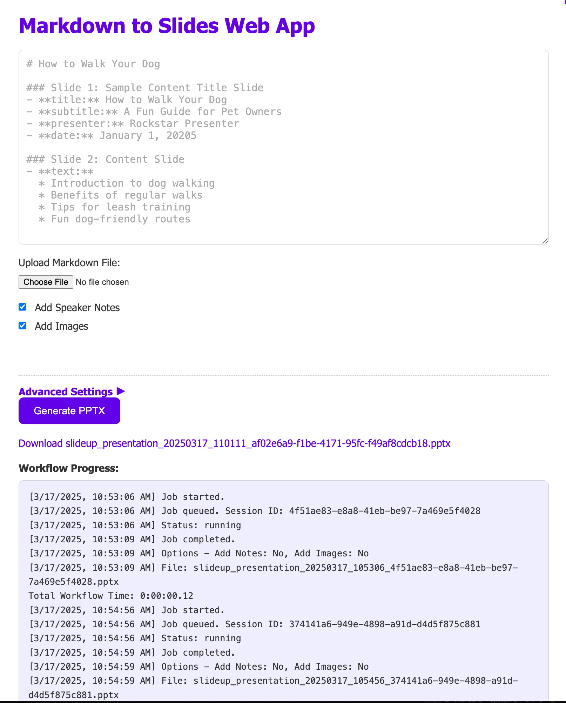

# SlideUp

A presentation assistant powered by AI that helps you create and improve PowerPoint presentations. This project offers two separate implementations:

1. **Agentic Implementation**: Using CrewAI framework with a Streamlit interface
2. **Flask Implementation**: Traditional web applications using Flask



## Repository Structure

```
slideup/
├── agentic/                 # CrewAI implementation
│   ├── app.py               # Streamlit application
│   ├── crews/               # AI crew implementations
│   │   ├── markdown2pptx_crew.py
│   │   └── pptx_enhancement_crew.py
│   ├── agents/              # Individual agent definitions
│   │   ├── designer_agent.py
│   │   ├── content_agent.py
│   │   └── formatter_agent.py
│   └── utils/               # Utility functions
│       ├── markdown_parser.py
│       └── pptx_generator.py
├── flask_apps/              # Flask web applications
│   ├── markdown2pptx_webapp.py    # Convert markdown to PPTX
│   ├── pptx_enhancement_webapp.py # Enhance existing PPTX files
│   └── templates/           # HTML templates
│       ├── markdown_form.html
│       └── pptx_form.html
├── lib/                     # Shared library code
│   ├── ai_services.py       # AI API interfaces
│   ├── slide_generator.py   # Core slide generation logic
│   └── pptx_utils.py        # PowerPoint manipulation utilities
├── requirements.txt         # Project dependencies
├── README.md                # This file
└── USER_GUIDE.md            # End-user documentation
```

## Features

* **AI-Powered Enhancement:**
  * Intelligent image generation using Stability AI
  * Natural speaker notes generation with OpenAI
  * Smart prompt engineering with DeepSeek
  * Custom prompt support for specialized needs

* **User-Friendly Interface:**
  * Simple Markdown input
  * Real-time preview
  * Progress tracking
  * Multiple export options

* **Professional Output:**
  * Clean, modern slide designs
  * Consistent styling
  * Proper formatting
  * Reference management

## Installation

1. Clone the repository:
```bash
git clone https://github.com/kosar/slideup.git
cd slideup
```

2. Create a virtual environment and activate it:
```bash
python -m venv venv
source venv/bin/activate  # On Windows: venv\Scripts\activate
```

3. Install the dependencies:
```bash
pip install -r requirements.txt
```

4. Set up your API keys (optional but recommended for full functionality):
```bash
export OPENAI_API_KEY="your-openai-api-key"
export STABILITY_API_KEY="your-stability-api-key"  
export DEEPSEEK_API_KEY="your-deepseek-api-key"
```

## Usage

### Option 1: Flask Web Applications

These are straightforward web applications that provide intuitive interfaces for creating and enhancing presentations.

#### Markdown to PowerPoint Converter

This application converts Markdown documents into PowerPoint presentations. It leverages the core functionality in [`lib/slide_generator.py`](lib/slide_generator.py).

```bash
# Start the Markdown to PowerPoint web application
python flask_apps/markdown2pptx_webapp.py
```

The server will start on http://127.0.0.1:5002. Open this URL in your browser to use the application.

#### PowerPoint Enhancement Tool

This application improves existing PowerPoint presentations by enhancing design, content, and structure.

```bash
# Start the PowerPoint Enhancement web application
python flask_apps/pptx_enhancement_webapp.py
```

The server will start on http://127.0.0.1:5003. Open this URL in your browser to use the application.

### Option 2: Agentic Implementation (CrewAI + Streamlit)

This implementation uses an agent-based approach with CrewAI for more sophisticated presentation creation and enhancement.

```bash
# Start the Streamlit application
streamlit run agentic/app.py
```

The application will open in your default web browser at http://localhost:8501.

#### How It Works

The agentic implementation uses specialized AI agents that collaborate to create better presentations:

1. **Content Agent** ([`agentic/agents/content_agent.py`](agentic/agents/content_agent.py)): Refines and enriches your content
2. **Designer Agent** ([`agentic/agents/designer_agent.py`](agentic/agents/designer_agent.py)): Handles visual design aspects
3. **Formatter Agent** ([`agentic/agents/formatter_agent.py`](agentic/agents/formatter_agent.py)): Ensures consistent formatting

These agents work together in crews ([`agentic/crews/`](agentic/crews/)) to complete complex presentation tasks.

## API Reference

### Flask API Endpoints

Both Flask applications expose API endpoints:

- `POST /api/convert`: Convert Markdown to PowerPoint
  ```python
  # Example request
  import requests
  
  response = requests.post(
      "http://127.0.0.1:5002/api/convert",
      json={
          "markdown": "### Slide 1: Title\n* First point",
          "add_speaker_notes": True,
          "add_images": True
      }
  )
  
  # Save the returned PPTX
  with open("output.pptx", "wb") as f:
      f.write(response.content)
  ```

- `POST /api/enhance`: Enhance an existing PowerPoint
  ```python
  # Example request
  import requests
  
  with open("presentation.pptx", "rb") as f:
      files = {"file": f}
      response = requests.post(
          "http://127.0.0.1:5003/api/enhance",
          files=files,
          data={"enhance_content": "true", "enhance_design": "true"}
      )
  
  # Save the enhanced PPTX
  with open("enhanced.pptx", "wb") as f:
      f.write(response.content)
  ```

## Markdown Format

SlideUp uses a simple Markdown format for creating presentations:

```markdown
### Slide 1: Title Slide
* **title:** Your Title
* **subtitle:** Your Subtitle
* **presenter:** Your Name
* **date:** Presentation Date

### Slide 2: Content Slide
* Main point
* Another point
  * Sub-point (indent with 2 spaces)
  * Another sub-point
* Back to main points
* Text with **bold** formatting

### Slide 3: Content with References
* Main point with reference
- **references:**
  * [Link Title](https://example.com)
  * [Another Source](https://example.org)
```

Key formatting rules:
1. Each slide must start with `### Slide X: Title`
2. Title slides require specific fields: `title`, `subtitle`, `presenter`, and `date`
3. Content slides use bullet points with `*` or `-` for main points
4. References must be in a separate section starting with `- **references:**`
5. Use 2 spaces for indentation of sub-points
6. Bold text is supported using `**text**`

## Development

### Running Tests

```bash
# Run all tests
pytest

# Run tests for specific components
pytest tests/test_slide_generator.py
pytest tests/agentic/
```

### Core Modules

- [`lib/slide_generator.py`](lib/slide_generator.py): The core slide generation engine
- [`lib/ai_services.py`](lib/ai_services.py): Interfaces with OpenAI, Stability AI, and DeepSeek APIs
- [`agentic/crews/markdown2pptx_crew.py`](agentic/crews/markdown2pptx_crew.py): Agent-based Markdown conversion

### Contributing

Contributions are welcome! Check out the [contributing guidelines](CONTRIBUTING.md) for more information.

## Resources

- [User Guide](USER_GUIDE.md): Detailed guide for end users
- [CrewAI Documentation](https://github.com/joaomdmoura/crewAI)
- [python-pptx Documentation](https://python-pptx.readthedocs.io/)

## License

This project is licensed under the MIT License - see the LICENSE file for details.

## Acknowledgments

* [python-pptx](https://python-pptx.readthedocs.io/) for PowerPoint generation
* [Flask](https://flask.palletsprojects.com/) for the web framework
* [Stability AI](https://stability.ai/) for image generation
* [OpenAI](https://openai.com/) for speaker notes generation
* [DeepSeek](https://deepseek.ai/) for prompt engineering
